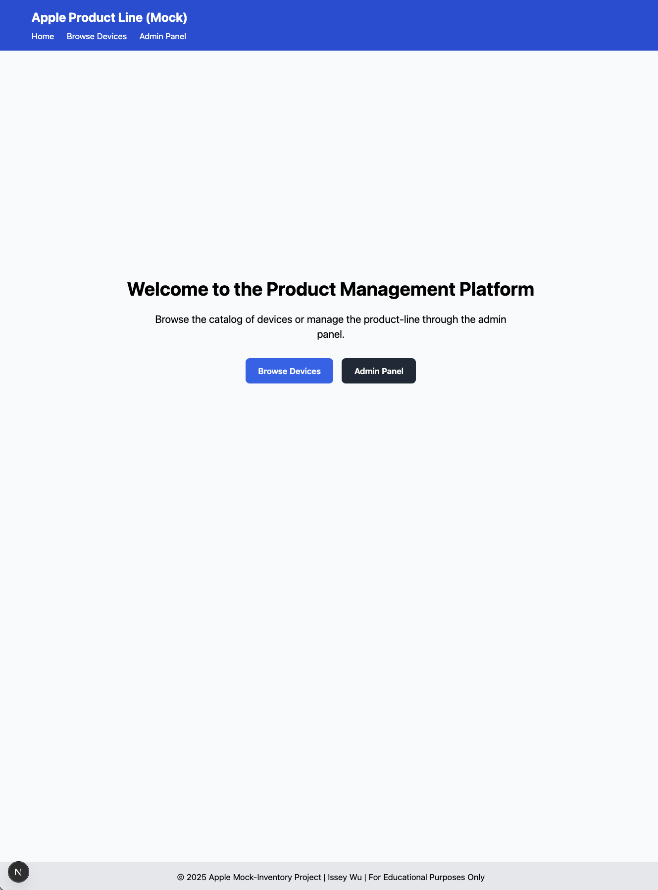
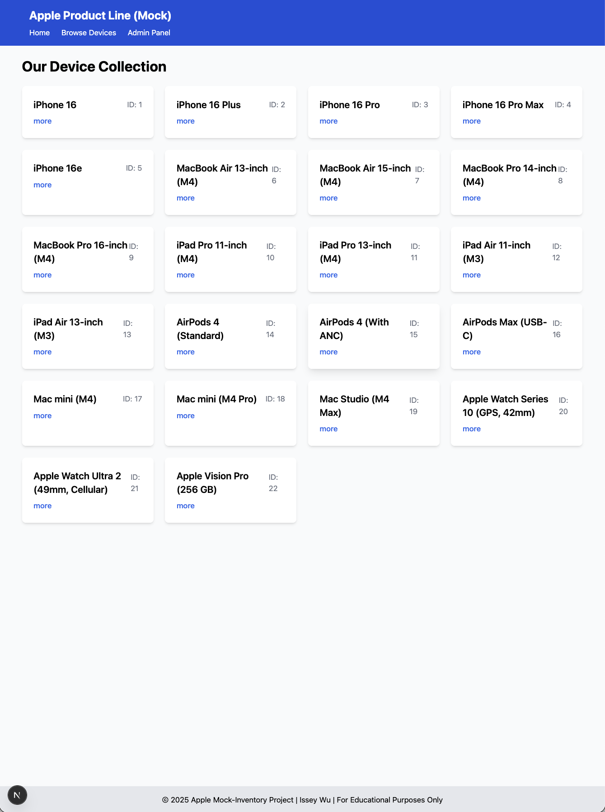
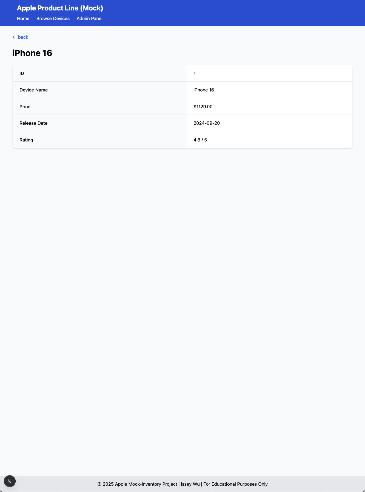
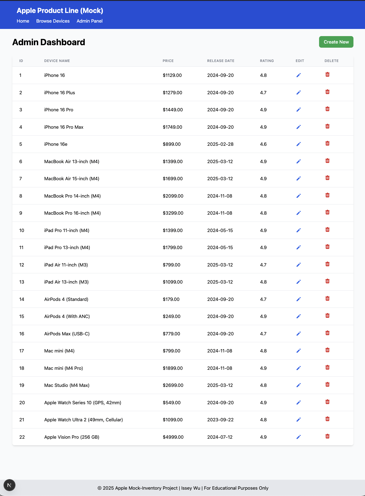
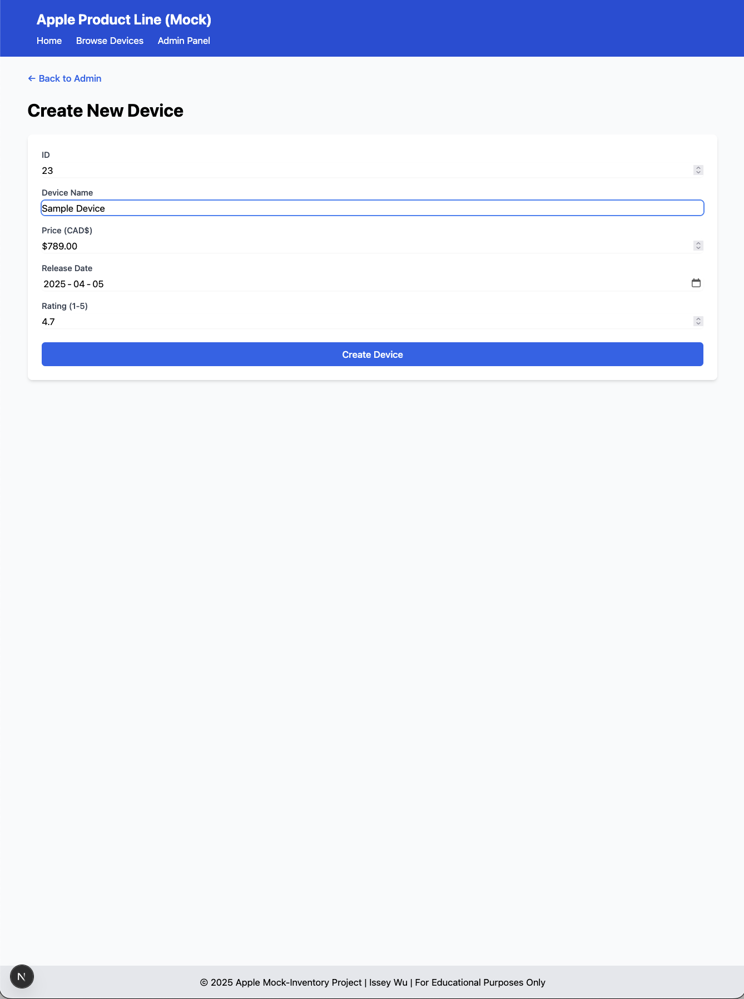
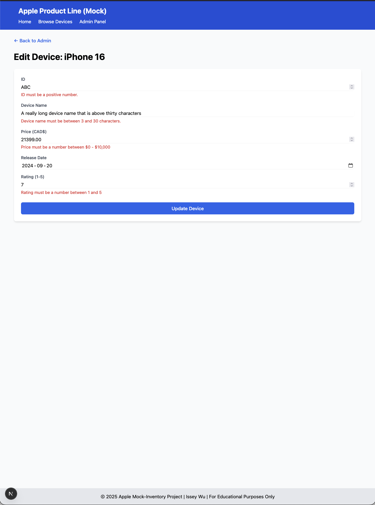
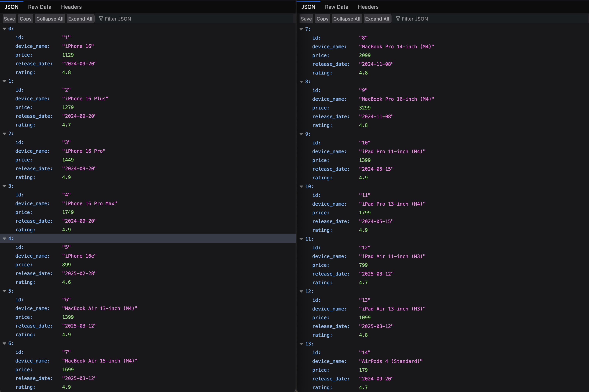

# 🍎 Apple Product Platform (Mock)

Welcome to the Apple Mock-Inventory Platform, a modern web application for showcasing and managing a catalogue of Apple products! This project is driven by my professional experience at Apple and is delivered through full-stack web applications using Next.js, RESTful APIs, and modern UI design principles.

## Purpose

This application is a mock product management system for Apple products that combines a public-facing catalogue with administrative functionality. Drawing inspiration from real-world retail systems, it provides a platform for browsing the latest Apple devices while allowing administrators to control product listings. Built with a clear separation of public-facing and administrative functionality, this system is just as easy for shoppers as for inventory managers. The website displays best practices in modern web development using Next.js, emphasizing functionality and user experience.

## What Can It Do?

This full-stack application helps you:
- **Browse the Apple product catalogue** with an intuitive and responsive interface
- **View detailed information** about each Apple device, including pricing and release dates
- **Manage the entire inventory** through an admin dashboard
- **Create, update, and delete products** with real-time form validation
- **Validate product data** to ensure consistency and accuracy

Whether you're a customer looking for information on the latest iPhone, iPad, or Mac or an administrator maintaining the product catalogue, this application empowers the entire process with a modern, user-friendly interface.

## Feature Showcase!

### Home Page:

The welcoming landing page provides clear navigation options for users to browse the device collection or access the administrative panel. A clean, modern design immediately communicates the purpose of the application and guides users to their desired destination.

### Collection View:

The collection page presents all Apple devices in a simple grid layout, showing just enough information to help users find what they're looking for. Each device card displays the device name and ID with a "more" link for accessing detailed information. The responsive design ensures a consistent experience across all devices.

### Device Detail View:

Clicking on a device reveals a detailed view with all device information in a structured format. The page includes key device attributes like price, release date, and rating in a clean, tabular layout with proper formatting for currency and dates. A back button also allows for easy navigation to the collection page.

### Admin Dashboard:

The admin dashboard provides an overview of all Apple devices in the inventory. Each device is presented in a row with all relevant information and action buttons for editing or deleting. The table format lets administrators quickly scan the entire inventory, while the "Create New" button makes adding new devices intuitive.

### Create Device Form:

Adding new devices is streamlined through a comprehensive form with fields for all attributes. The form implements real-time validation to ensure all data meets the required criteria, with clear error messages when validation fails *(see next image)*. The interface guides administrators through the process with properly labelled fields and helpful input constraints.

### Edit Device Form with Validation:

The edit form allows administrators to modify existing device information with assurance. Real-time validation occurs when users enter a field, showing validation errors immediately. This ensures data integrity while providing a smooth user experience. Before editing, all fields are pre-populated with the current device data, making it easy to update only what needs changing.

### RESTful API:

Behind the scenes, the application is powered by a RESTful JSON API that manages the device data. The API follows standard REST conventions and provides endpoints for fetching, creating, updating, and deleting devices. This separation of concerns ensures a clean architecture and makes the application more maintainable.

## Behind the Scenes

This application leverages both modern web technologies and best practices:

| Component | Technologies |
|-----------|-------------|
| **Frontend** | Next.js, React, Tailwind CSS |
| **Backend** | Next.js Server Components, Server Actions |
| **API** | RESTful JSON API (json-server) |
| **Data Validation** | Client-side and server-side validation |
| **Rendering Patterns** | Server Components, Static Site Generation |
| **State Management** | React useState and controlled forms |
| **Architecture** | App Router, Dynamic Routes, API Revalidation |
| **Developer Experience** | TypeScript, ESLint, Turbopack |

The application demonstrates the following Next.js concepts:
- Server Components for data fetching
- Client Components for interactive elements
- Server Actions for data mutations
- On-demand revalidation for keeping content fresh
- Static site generation with dynamic parameters
- Responsive design with Tailwind CSS

## API Documentation

The application is powered by a RESTful API running on JSON Server. These are my key endpoints:

| Endpoint | Method | Description |
|----------|--------|-------------|
| `/devices` | GET | Retrieve all devices |
| `/devices/:id` | GET | Retrieve a specific device by ID |
| `/devices` | POST | Create a new device |
| `/devices/:id` | PUT | Update an existing device |
| `/devices/:id` | DELETE | Delete a device |

**Example Device Object:**
```json
{
  "id": "1",
  "device_name": "iPhone 16",
  "price": 1129.00,
  "release_date": "2024-09-20",
  "rating": 4.8
}
```
## Why I Built This:

I created this Apple-inspired inventory management system, directly drawing from my experience working at Apple as a Product Specialist. During my time there, I gained firsthand exposure to sophisticated inventory management systems. I saw how crucial they are for maintaining product data, tracking stock, and providing accurate information to both customers and staff.

---

**Note:** This is an educational project and is not affiliated with, endorsed by, or connected to Apple Inc. in any way. All product names, logos, and brands are property of their respective owners. The mock product data used in this application is for demonstration purposes only.
